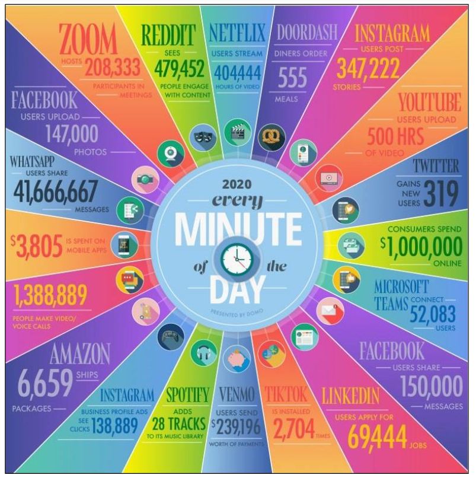
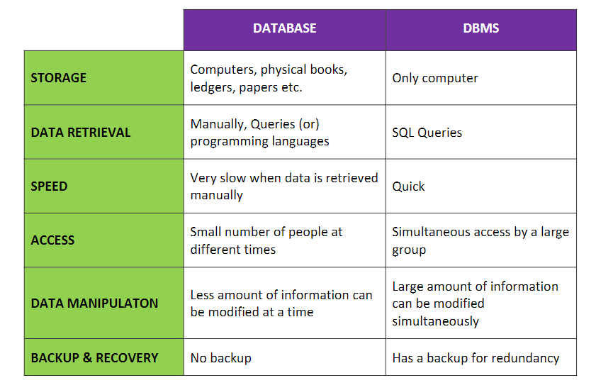
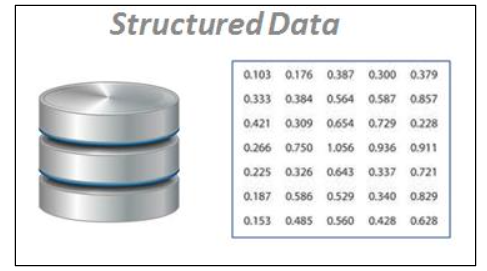
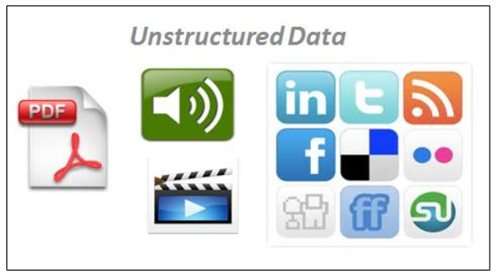
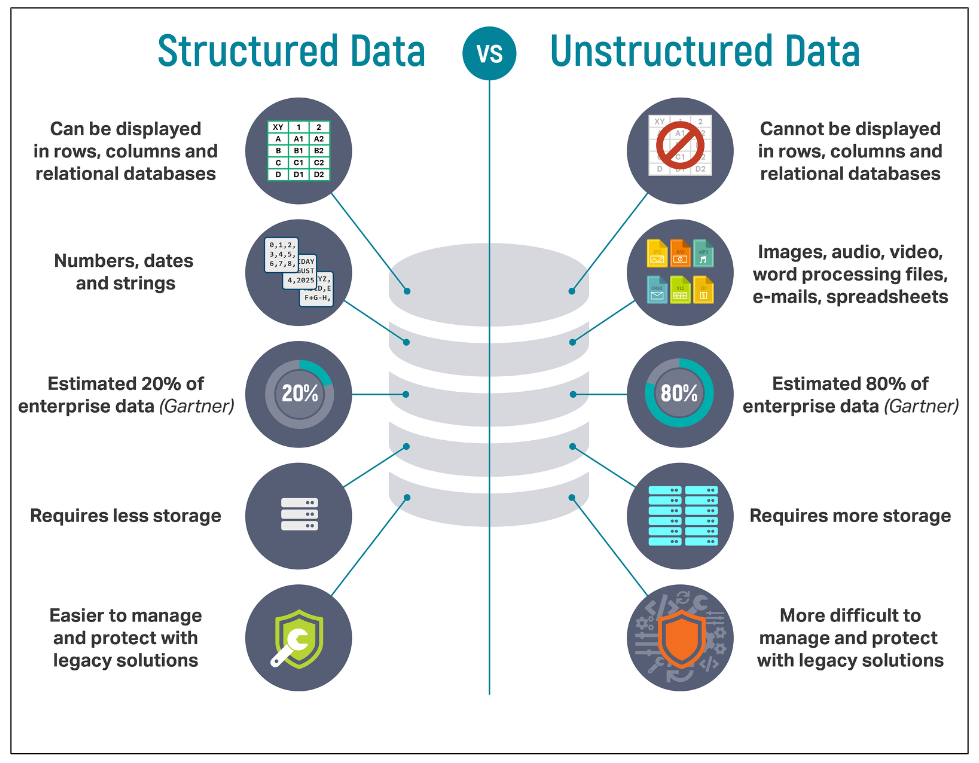

## Introduction to Databases

Data is available in large amounts in the current time and databases help store these data. A database is a collection of data which it holds in a structed format. Data from a database can be accessed in multiple ways.

## Database Management Systems (DBMS)
DBMS is a software which is used to store, edit, and extract the data in a database.  The features of a DBMS help to manage the data in a robust and efficientmanner.A DBMS can accept queries  from  various  interfaces  and  executes  them  against  the  data  stored  in  a  database  and fetches & produces the results.

## STRUCTURED vs UNSTRUCTURED DATA:
Structured  dataare  highly  organized. They  can  be  mapped  into  specific  fields  such  as names, country, zip codes etc. They are generally stored and organized in the format of tables and spreadsheets. Structured data are easy to work with and make up 20% of the data currently. Generally structured data are stored in RDBMS (Relational Database Management Systems) and are managed using SQL (Structured Query Language).

Unstructured  dataon  the  other  hand  do  not  have  any pre-defined  structure. This data cannot be processed (or) analyzed using any conventional methods/tools. With the Social media boom unstructured data is now  being produced at a rapid pacemaking up 80% of the current data. Examples  of  this  type    of  data  include  images,  audio,  video  etc.  Unstructured    data  are generally stored and handled by NoSQL databases.


