FIXME

## Relational Database Management Systems (DBMS)
A  Relational  Database  Management  Systems  (RDBMS) is  a  program  used  to  manage  a relational  database.  In  a  relational  database  data    is  mostly  organized  into  tables  and  the database  helps  us  identify  and  access  data  in  relation  to  another  data  within  the  database.  A single database may comprise of multiple tables and they might be related to each other.

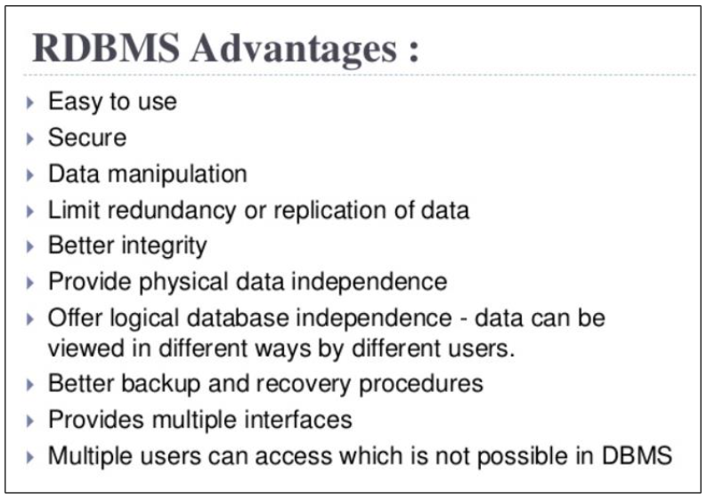
 
## ENTITY–RELATIONSHIP(ER) MODEL
The ER  model  is  used  to  describe  the data  in  terms  of  objects  (entities)  along  with  the relationships between them. It helps us to understand how the underlying data in an organization are linked to each other.

*ENTITY*:

* Entity –An entity is an object of the real world which can be distinguished from other objects. Entity –Examples of entities area student in the CS department, a lecturer in the MISEntity –department, a teaching assistant in physics department etc.

* Entity Set –A collection of similar entities is referred to as an Entity set. For example, collection Entity Set –of all employees at a university. An entity may not belong to just one entity set, it Entity Set –can be present in multiple sets, in otherwords entity sets need not be disjoint. For Entity Set –example a student working as a Teaching Assistant may belong to an entity set,list Entity Set –of all students in a university and another set,all teaching assistant at a university.

* Attributes –Each entity is described by a set of features called attributes. For a student at UIC Attributes –the attributes could be UIN, major, level (Undergrad, Graduate or PhD) etc. All the Attributes –entities in anentity set are similarand have the same set of attributes. Each attribute has a particular domaini.e. for Name attribute the domain could be string of length 30, while for UIN would be 9-digit integers. Each entity set also has a primary key, which is an attributewhose value is used to uniquely identify each record (or) entity in the set, e.g. UIN .A list ofattributes whose values are unique for each entity is known as candidate key, e.g. UIN, NetID and email.

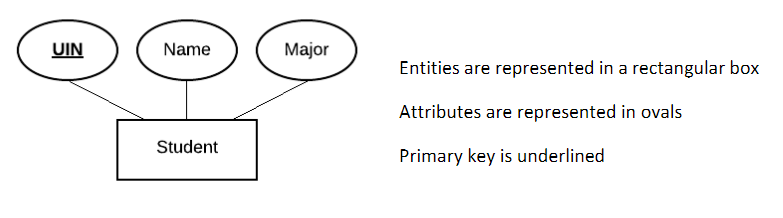

## RELATIONSHIP:
A  relationship  helps  define  the  relation  between  different  entities  i.e.  how  an  entity  is related   to   another. Consider   an   organization   which   has   two   entity   sets,   Employee   and Department. The relationship between them would be “works in” as in employee “works in” a department. Information about the relationship is referred to as descriptive attributes.

Relationship setis a collection of relationships of the same type. For e.g Employee E1 works in Department  D1  is  a  relationship,  while Employees    E2,  E3,  E5,  E6  works in  Department  D2  is  a relationship set (since it is  a collection of relationships).

A relationship set is represented in a diamond

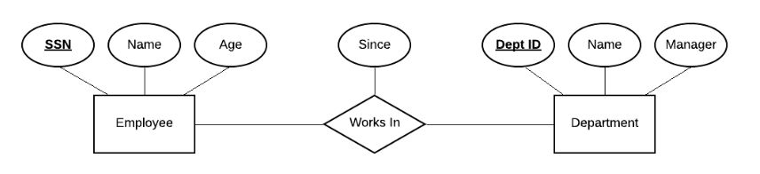

## Types (Cardinality)
Cardinality refers to how many entities in tow entity sets can be related to each other.

* One-to-One: A single entity in an entity set is related to only one single entity in another set

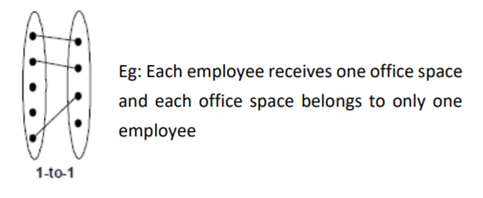

* One-to-Many: A single entity in an entity set is related to multiple entities in another set. The vice versa where multiple entities in one set are related to a single entity in another set is known as many-to-one

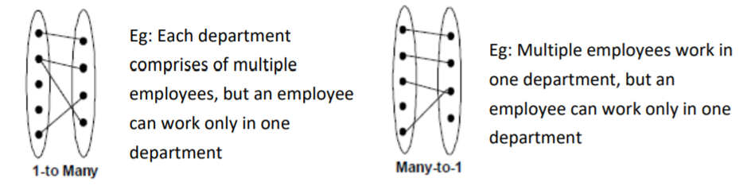

* Many-to-Many: Every entity in one set is related to multiple entities in second set and similarly every entity in the second set is related to multiple entities in the first set.

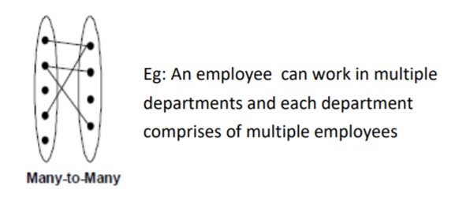

## WEAK ENTITY

A weak entity is an entity set which does not have a primary key of its own. They are identified uniquely based on the primary key of another entity. For example, in an organization consider employees purchase policies for their dependents (family members), then the entity set Dependents is a weak entity.

Weak entities are represented using thick rectangular boxes.

Note that Name is not a unique identifier on its own for Dependents entity set. There can be multiple people with the name John under dependents. Once an employee entity is chosen then the Name can be used to uniquely identify the dependents of that particular employee. Hence Name is known as partial key of weak entity set.

Restrictions:
* The relationship of Owner entity set to Weak entity set must be one-to-many (one owner to many weak)
* The weak entity must have complete participation in the identifying relationship (indicated by the arrow)

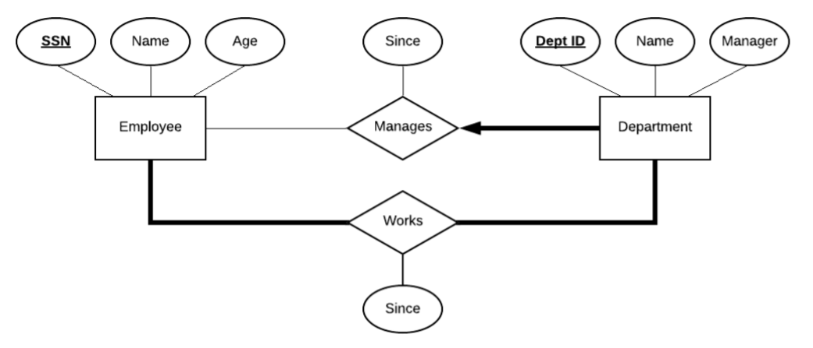

## “IS A” HIERARCHY

The IS A hierarchy is used to classify an entity set into subclasses. For e.g. an entity set Employee may be classified into subclasses of Hourly_Employee , Contract_Employee (or) Senior_Employee, Junior_Employee etc. All the attributes of the parent entity set are inherited i.e. present in its subclasses.

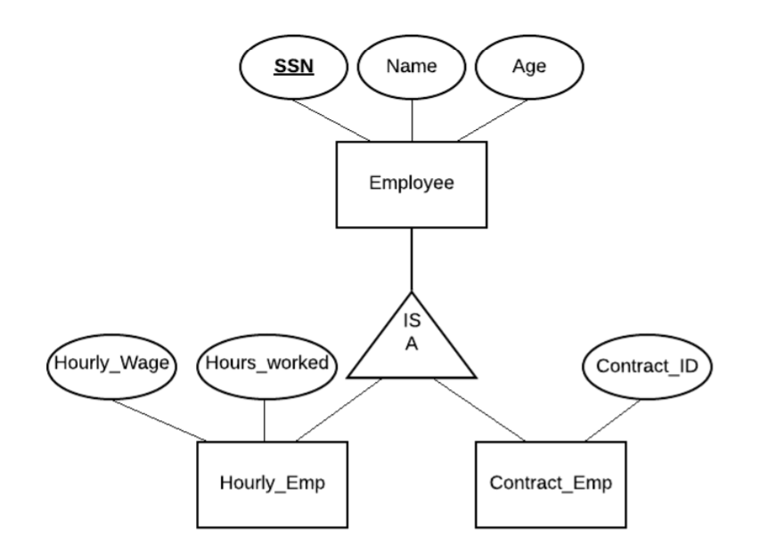

Constraints:
* Overlap – Can one single entity be present in more than one subclass? A single employee cannot be part of both Hourly_Employee & Contract_Employee. But if an entity set has Contract_Employee & Senior_Employee as its subclass then an employee can be present in both subclasses. Can be represented as Contract_Employee OVERLAP Senior_Employee
* Covering – Does all the entity of subclass cover all the entities of a parent (or) super class. All the entities of Employee parent class may not belong to subclass Hourly_Employee but all entities of Employee parent class may belong to the combined entities set of Hourly_Employee & Contract_Employee. This can be represented as Hourly_Employee AND Contract_Employee COVER Employee.

## AGGREGATION

We use an aggregation to model a relationship between entity sets and relationship set. For e.g. Consider in an organization various department sponsor various projects. Here the entities are Project and Department while the relationship between them is Sponsors.

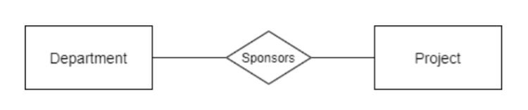

Consider that the employees of the organization are assigned to monitor this sponsor ship. Thus, the employees are supposed to monitor the sponsorship. To model a relationship (Monitors) between an entity (Employee) and a relationship set (Sponsors) we use an aggregation represented by the dashed box.

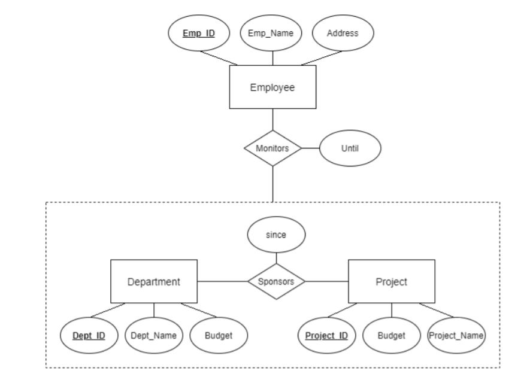

## ER MODEL RULES

Total Participation – All entities of an entity set participate in the relationship. This is represented by a thick line between entity set and relationship in the diagram.

Partial Participation – Not all entities of the entity set will participate in the relationship. This is represented by a thin line between entity set and relationship in the diagram.

At most one – Each entity in this entity set is related to at most one entity in the other entity set it is related. This is indicated by an arrow between entity set and relationship in the diagram.

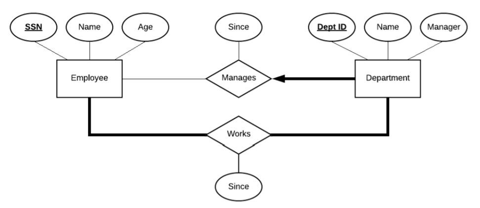

In the above diagram, there is a total participation by Employee entity with Department entity through works relationship. This indicates that all employees belong to some department in the organization. Similarly, there is a total participation by Department entity with Employee entity through worksrelationship indicating in each department there is at least one employee working. There is a partial participation by Employee entity with Department entity through the manages relationship. This shows not all employees manage a department but only some. The Department entity has a thick line indicating complete participation with an arrow at the end indicating at most one through the manages relationship. This shows that all departments are manages by some employee (total participation – thick line) but each department is managed by at most one (arrow) employee.



