Microsoft Access is a database management tool which is simple to use. It provides an easy, userfriendly user interface to create, edit and manage databases. 

In a relational database, data is generally stored in the form of tables. Each table here represents an entity set while the columns of the table represent the entity attributes. Each row in the table
represents a single entity inside the entity set.

Note: Every UIC student should have free access to Microsoft office product. Once you open MSAccess in your device if prompted to sign in, use your UIC email address and password to sign in.

## CREATING DATABASE AND TABLES:
* Open MS-Access
* Select Black database option
* Provide a name for the database (e.g. Sample_Database) and then click Create

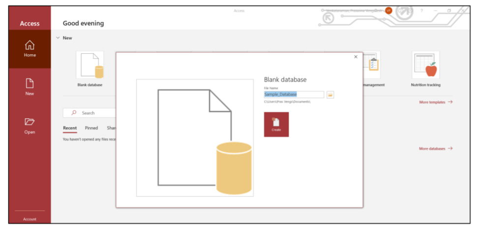

* Once done the first table is automatically generated
* Now select Create from the menu bar and select Table twice to create two additional tables (entity sets)

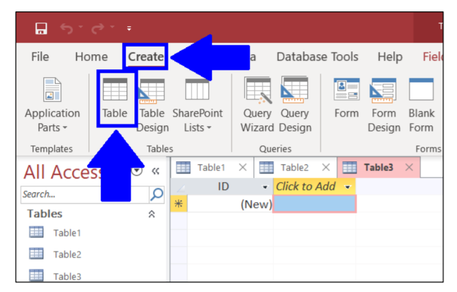

* Now rename the 3 tables as: Customer, Item, Purchase. To rename a table, select the table at the top and not on the left pane and then press Ctrl+S

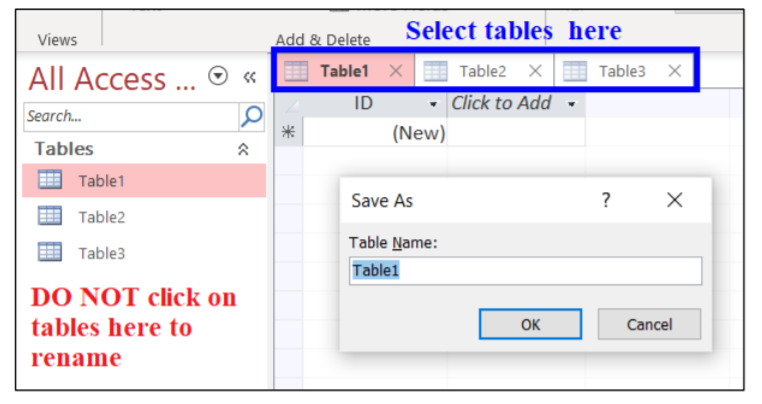

* To create columns (attributes) for a table, select the particular table on top and switch to design view by clicking on View (or) Down Arrow on View → Design View

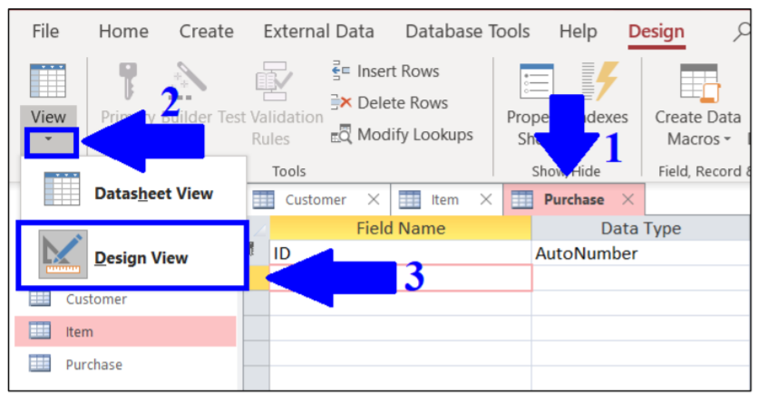

* In Design View enter the column names (or) attributes for each table as shown in the image below and then save the table before moving to the next table

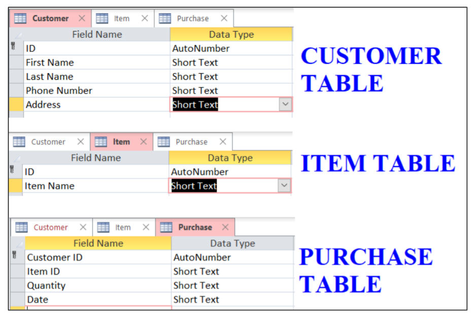

## DATA TYPES – FIELD PROPERTIES & FORMATTING

* MS-ACCESS provided a list of pre-defined data types rom which we need to assign a single data type for each attribute

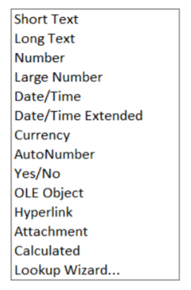

* Set the Data Type for each attribute by selecting it from the corresponding drop-down box

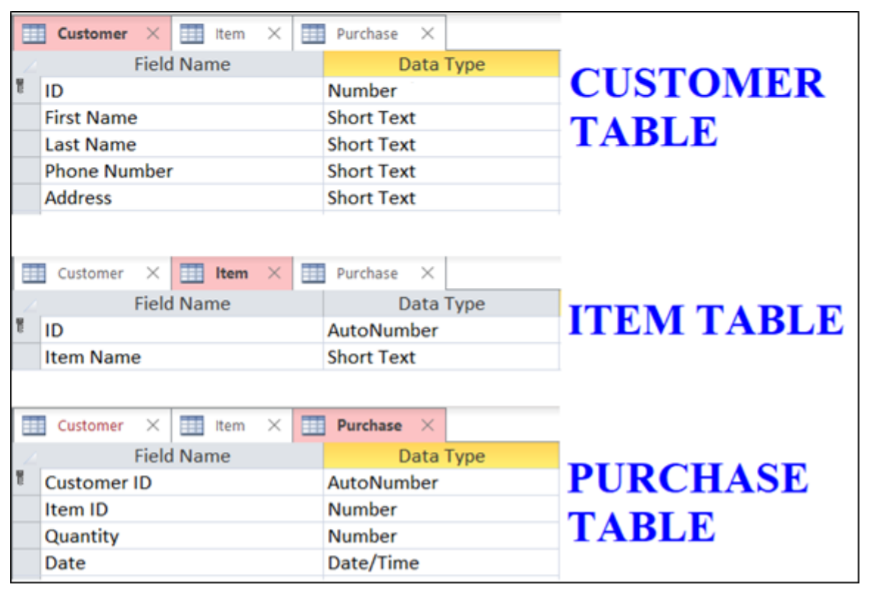

* The Field Properties box can be located at the bottom of the page when a particular Field or its Data Type is selected in the Design View

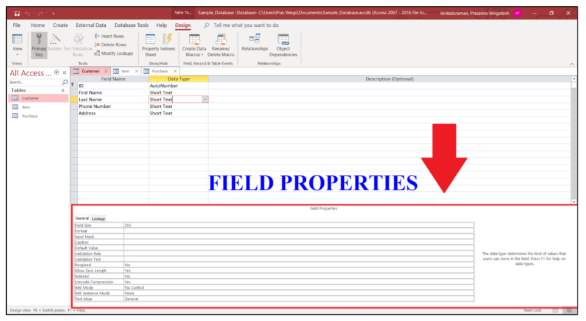

* Enter Field Size as 30 for First Name and Last Name and 100 for Address in Customer table

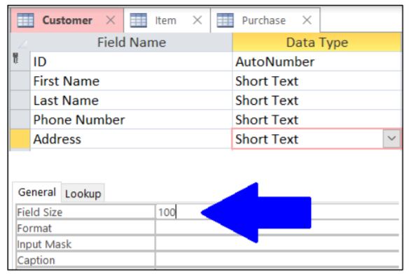

* For Phone Number in Customer table click on Input Mask first and then click on three dots at the end of property

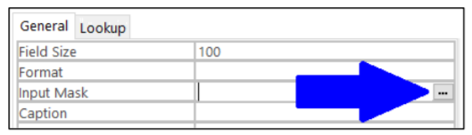

* Now Select Phone Number option and click Next.
* In the next dialog box, replace the 999 with 000 (9 → optional to enter ; 0 → mandatory to enter) and click Next
* In the final dialog box, choose the preferred format to display the number and click Finish

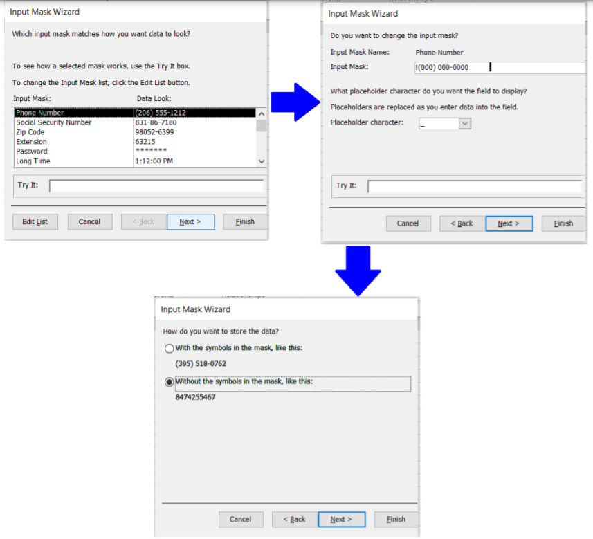

* To set the primary key, select the attribute in Design View and click on the particular attribute and click the primary key icon. To make multiple attributes as primary key, select all the attributes by clicking on the grey box to its left while holding down Ctrl key and click the primary key icon

Set the primary keys as below:

Customer - ID

Item - ID

Purchase - Customer ID, Item ID, Date

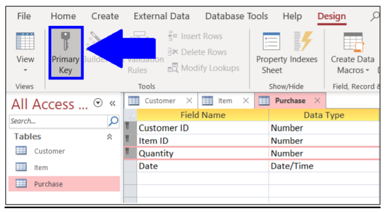

* Now Enter a few sample data in all the three tables

## RELATIONSHIPS

* Select Database Tools → Relationships to open the relationships window

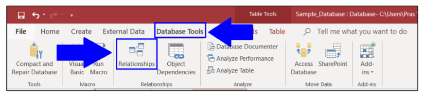

* Now drag all three tables into the relationship window

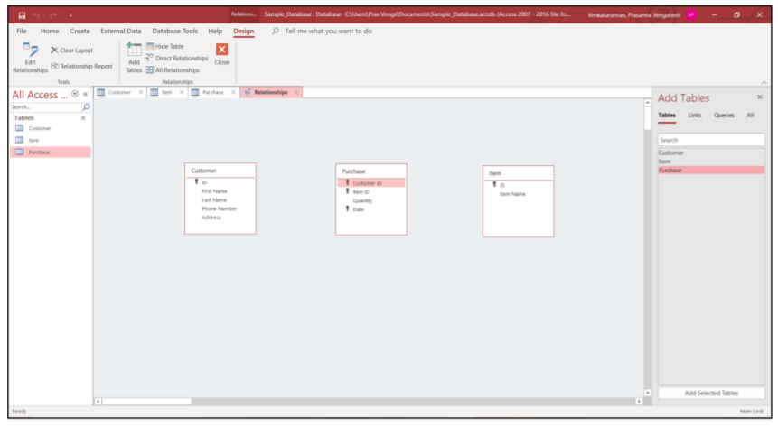

* Now click on Customer.ID column and drag & drop it on Purchase.Customer ID column. Check the “Enforce Referential Integrity” checkbox and click Create

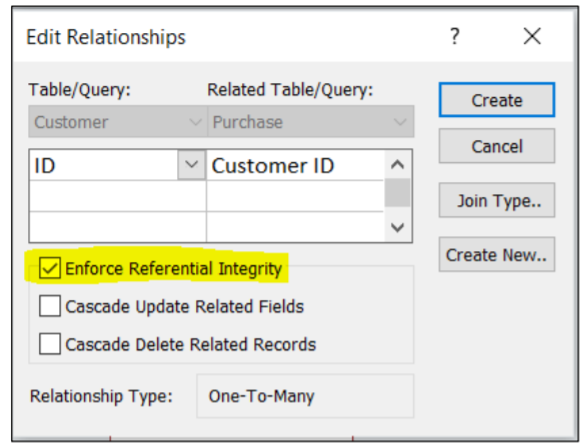

Referential Integrity – Helps prevent actions which might affect the relationship. For e.g.
Changing only the data type of ID column in Customer table to Text but not the Customer ID
column in Purchase table.

* Now repeat the above step with Ite.ID column & Purchase.Item ID column
* Once the relationships have been established the final output looks as below

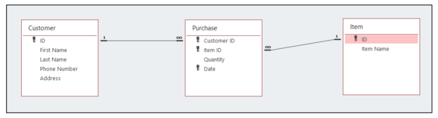

## QUERIES

Queries help fetch data from tables based on the search criteria provided

Query 1 – Items purchased by customers with First Name “Kevin”

* Select Create → Query Design from the menu bar

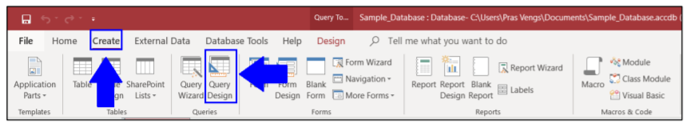

* Double click on all three tables on the right pane (Add tables) to import them in the query

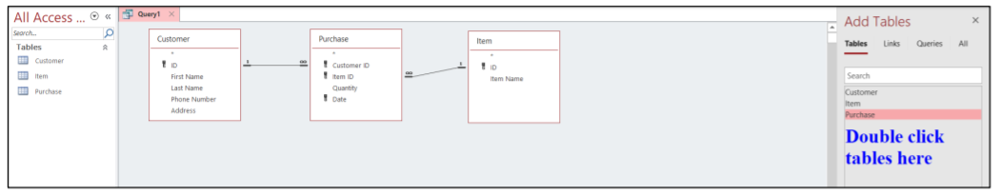

* In the query Pane below select the columns from the corresponding tables which need to be
viewed and set conditions on

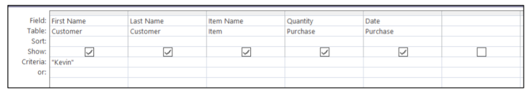

* Now in the menu bar select Design and click on RUN

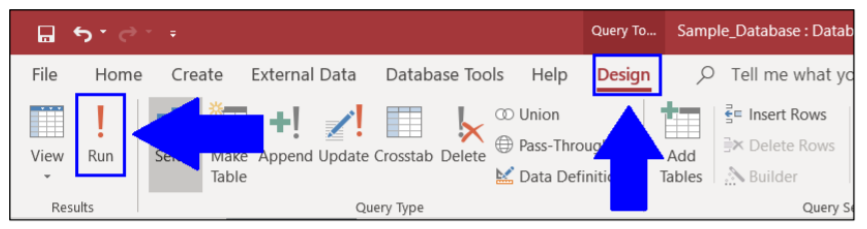

* The final Output will now be displayed as below

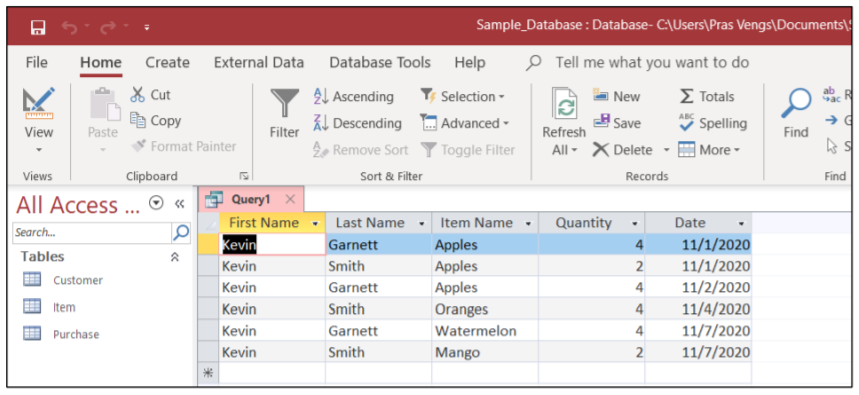

Query 2 – Items purchased by customers with First Name “Kevin” OR “Selena”

* Repeat first two steps as Query 1 and now set the below conditions on the corresponding columns (attributes)

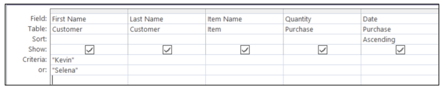

* Now RUN the query and you will receive the output as below

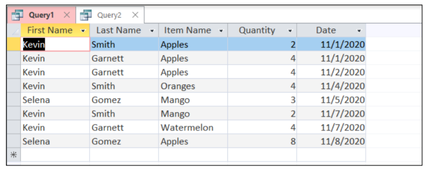

Query 3 – Items purchased by customers with First Name “Kevin” AND Quantity greater than 3

* Repeat first two steps as Query 1 and now set the below conditions on the corresponding columns (attributes)

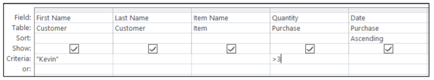

* Now RUN the query and you will receive the output as below

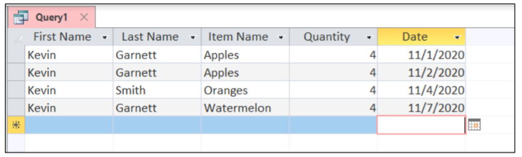


