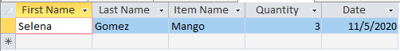

> ## ER Diagram exercise
>
> Draw a ER diagram representing the database of students attending courses.
>
> > ## Solution
> >
> > Multiple solutions possible.
> >
> > ER diagram of students attending courses
> > 
> >
> {: .solution}
>
> ## MS Access Database queries exercise 1
>
> Using MS Access, retrieve the Items purchased by customers with First Name “Selena” AND Quantity less than 5
>
> > ## Solution
> >
> > Query
> > 
> >
> > Result
> > 
> >
> {: .solution}
> ## MS Access Database queries exercise 2
>
> Using MS Access, retrieve the Items purchased by customers with First Name "Kevin" or “Selena” on date 8th November, 2020
>
> > ## Solution
> >
> > Query
> > 
> >
> > Result
> > 
> >
> {: .solution}
{: .challenge}
